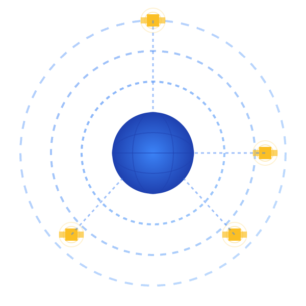

# GNX-py
<p align="center">
  
</p>

*A modular GNSS analysis library for PPP, SISRE/URE evaluation, and ionospheric modelling*

---

## Overview

**GNX-py** is a Python library for advanced GNSS data processing. It provides a modular architecture covering three major domains in high-precision GNSS analysis:

- **PPP** – Precise Point Positioning (code, phase, uncombined PPP)
- **SISRE / URE** – Satellite orbit and clock quality assessment
- **Ionosphere** – STEC, VTEC, GIM, spherical harmonics modelling, DCB estimation, and ionospheric monitoring

This project is designed for researchers, engineers, and students requiring high-accuracy GNSS tools in pure Python.

---
## Use of sample data

In the repository, you will find a folder called sample data, which contains observation RINEX file along with several GNSS products. To test the program, use them in the prepared scripts: PPP, SPP, STEC, and SIS Session. This will allow you to quickly test the basic functions of the program. In the scripts, you only need to substitute the appropriate paths to the sample data.

---

## Interactive tutorials
The $tutorial$ folder contains Jupyter Notebooks with a guide to the software. Due to space limitations in the main repository, the data for the tutorials can be found in the Releases section. There you will find the **tutorial_data.zip** file containing the data needed to run the tutorial. 

---
## Features

### Precise Point Positioning (PPP)
- PPP with GPS and Galileo 
- Kalman filter framework (EKF)
- Satellite and receiver corrections (PCO/PCV, tides, troposphere, relativity)

### SISRE / URE Analysis
- Orbit and clock comparison
- R/A/C decomposition
- SISRE and URE computation
- Quality control metrics

### Ionospheric Tools
- STEC computation
- VTEC estimation
- Kriging 
- Ionospheric activity indexes (SIDX, GIX, ROTI) 

---

## Repository Structure

```
GNX/
├─ gnx_py/        # Python package (import gnx_py)
│   ├─ ppp/
│   ├─ ionosphere/
│   ├─ orbits/
│   └─ core modules
├─ setup.py       # Package installer
└─ README.md
```

**Large files such as full tutorial bundles (ZIP > 100 MB)** are stored as *Release Assets* under GitHub Releases.

To take full advantage of the interactive notebooks that make up the GNX-py manual, download the files from *Release Assets*.

---

## Installation

### Install in development mode
Recommended Python version: **3.12+**
```
git clone https://github.com/HJpierzchala/GNX.git
cd GNX


# Windows
py -3.12 -m venv .venv
.venv\Scripts\activate
python -m pip install -U pip

Option A (recommended, reproducible)
pip install -e . -c constraints-win.txt

Option B (lets pip choose versions inside allowed ranges)
pip install -e .

# MacOS
python3.12 -m venv .venv
source .venv/bin/activate
python -m pip install -U pip

Option A (recommended, reproducible)
pip install -e . -c constraints-macos.txt

Option B (lets pip choose versions inside allowed ranges)
pip install -e .
```

### Usage example

```python
import gnx_py as gnx 
from gnx_py.ppp import PPPConfig, PPPSession
from gnx_py.ionosphere import TECConfig TECSession
from gnx_py.orbits import SISConfig, SISController
```

---

## Tutorials & Documentation

A complete tutorial bundle is available under:

👉 **Releases → Latest → tutorial_data.zip**

This includes:
- PPP workflows
- Orbit comparison & SISRE analysis
- Ionospheric modelling (STEC → VTEC → Kriging, Calibration & Activity indices)
- Visualization tools


---

## Roadmap
Currently, the program has many bottlenecks that slow down processing. Not everything has been successfully vectorized. Some elements will be improved in the coming months. 
Planned features:
- PPP-AR full pipeline
- Regional GIM estimation with Spherical Harmonics + KF 
- Cython & parallel acceleration
- Processing of other GNSS systems, especially BeiDou and GLONASS

Contributions and suggestions are welcome. It would be really cool if GNX-py became an easy-to-use, enjoyable tool for research and learning. If you have any ideas, suggestions, or comments, let us know on GitHub. 

---

## Contributing

Pull requests are welcome. You may contribute:
- new modules
- improved algorithms
- documentation & notebooks
- positioning & analysis tools

For ideas or issues, open a GitHub Issue.

---

## License

Released under the **MIT License**.
See `LICENSE` for full terms.

---

## Citation

A `CITATION.cff` file will be added in a future release.

---

## Acknowledgements

GNX-py aligns with standards and products from:
- IGS (SP3, CLK, RINEX)
- CODE, JPL, WHU
- Classical PPP & ionospheric modelling literature
- **Currently, only RINEX 3 is supported. RINEX 4 & 2 support will be integrated soon**
---

### ⭐ If this project is useful, consider giving it a star on GitHub!
