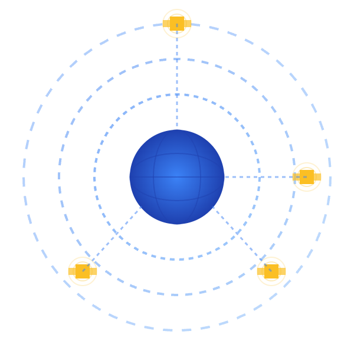

# GNX-py
<p align="center">
  
</p>

*A modular GNSS analysis library for PPP, SISRE/URE evaluation, and ionospheric modelling*

---

## Overview

**GNX-py** is a Python library for advanced GNSS data processing. It provides a modular architecture covering three major domains in high-precision GNSS analysis:

- **PPP** – Precise Point Positioning (code, phase, uncombined PPP)
- **SISRE / URE** – Satellite orbit and clock quality assessment
- **Ionosphere** – STEC, VTEC, GIM, spherical harmonics modelling, DCB estimation, and ionospheric monitoring

This project is designed for researchers, engineers, and students requiring high-accuracy GNSS tools in pure Python.

---
## Use of sample data

In the repository, you will find a folder called sample data, which contains observation RINEX file along with several GNSS products. To test the program, use them in the prepared scripts: PPP, SPP, STEC, and SIS Session. This will allow you to quickly test the basic functions of the program. In the scripts, you only need to substitute the appropriate paths to the sample data.

---

## Interactive tutorials
The $tutorial$ folder contains Jupyter Notebooks with a guide to the software. Due to space limitations in the main repository, the data for the tutorials can be found in the Releases section. There you will find the **tutorial_data.zip** file containing the data needed to run the tutorial. 

---
## Features

### Precise Point Positioning (PPP)
- PPP with GPS and Galileo
- BeiDou PPP for single-system combined/uncombined workflows and two-system uncombined mixed workflows
- Known limitation: PPP uncombined mixed without ionospheric constraints is still an active validation topic for BeiDou.
  The current recommended BDS PPP path is combined PPP or BDS-only uncombined PPP with ionospheric constraints;
  mixed uncombined no-constraints should be treated as experimental until the datum/bias model is revisited.
- Kalman filter framework (EKF)
- Satellite and receiver corrections (PCO/PCV, tides, troposphere, relativity)

### SISRE / URE Analysis
- Orbit and clock comparison
- R/A/C decomposition
- SISRE and URE computation
- Quality control metrics

### Ionospheric Tools
- STEC computation
- VTEC estimation
- Kriging 
- Ionospheric activity indexes (SIDX, GIX, ROTI) 

### Supported Constellations
- GPS
- Galileo
- BeiDou/BDS for RINEX observation loading, preprocessing, broadcast MEO/IGSO SPP, precise/SIS products, STEC, single-system PPP, and two-system uncombined mixed PPP
- See `docs/BEIDOU.md` for supported signals and current BDS limitations

---

## Repository Structure

```
GNX/
├─ pyproject.toml # Package metadata and dependency declaration
├─ setup.py       # Compatibility shim for setuptools
├─ gnx_py/        # Python package (import gnx_py)
│   ├─ ppp/
│   ├─ ionosphere/
│   ├─ orbits/
│   └─ core modules
├─ examples/      # Editable example scripts using sample_data
├─ sample_data/   # Example input data kept outside the Python package
└─ README.md
```

**Large files such as full tutorial bundles (ZIP > 100 MB)** are stored as *Release Assets* under GitHub Releases.

To take full advantage of the interactive notebooks that make up the GNX-py manual, download the files from *Release Assets*.

---

## Installation

GNX-py is installed as the Python package `gnx_py`. After installation, it can
be imported from any working directory as long as the same virtual environment
is active, or selected as the interpreter in an IDE.

Recommended Python version: **3.12**.

### macOS / Linux

```bash
git clone https://github.com/HJpierzchala/GNX.git
cd GNX

python3 -m venv .venv
source .venv/bin/activate
python -m pip install --upgrade pip
pip install -e .
```

For a non-editable install, use:

```bash
pip install .
```

### Windows PowerShell

```powershell
git clone https://github.com/HJpierzchala/GNX.git
cd GNX

py -m venv .venv
.venv\Scripts\Activate.ps1
python -m pip install --upgrade pip
pip install -e .
```

For a non-editable install, use:

```powershell
pip install .
```

### Verify the Import

From any directory, with the environment active:

```bash
python -c "import gnx_py; print(gnx_py.__file__)"
```

The printed path should point to this repository for an editable install, or to
the environment's `site-packages` directory for a normal install.

### Developer Install

Developer and test tools are available as an optional extra:

```bash
pip install -e ".[dev]"
```

The existing `requirements-runtime.txt` and `requirements-dev.txt` files are
kept for users who prefer requirements-file workflows. Constraint files can be
used when reproducing a known platform setup:

```bash
pip install -e . -c constraints-macos.txt
pip install -e . -c constraints-win.txt
```

### Usage Example

```python
import gnx_py as gnx 
from gnx_py.ppp import PPPConfig, PPPSession
from gnx_py.ionosphere import TECConfig, TECSession
from gnx_py.orbits import SISConfig, SISController
```

### Using in IDE

Create and install GNX-py in a virtual environment first, then select that
environment as the interpreter in your IDE:

- macOS / Linux: `.venv/bin/python`
- Windows: `.venv\Scripts\python.exe`

After the interpreter is selected, `import gnx_py` works in notebooks, scripts,
test files, and terminals launched from the IDE.

### Running Examples

Example scripts live in `examples/` and use the repository `sample_data/`
directory by default. Run them from the repository root after installing the
package:

```bash
python examples/run_spp_example.py
python examples/run_ppp_example.py
python examples/run_sise_example.py
python examples/run_stec_example.py
```

Each script has a `USER SETTINGS` section near the top where you can change
stations, systems, signal modes, product paths and smoke-test time windows.
Generated files are written to `examples/output/`, which is ignored by Git.

### Troubleshooting

- If `import gnx_py` fails, check that the intended virtual environment is
  active.
- If dependencies are missing, run `pip install -e .` again from the repository
  root.
- If an IDE cannot see `gnx_py`, select the `.venv` interpreter created for this
  repository.
- If `print(gnx_py.__file__)` points to a different local clone, clear any stale
  `PYTHONPATH` entry and reinstall in the active environment.

---

## Tutorials & Documentation

A complete tutorial bundle is available under:

👉 **Releases → Latest → tutorial_data.zip**

This includes:
- PPP workflows
- Orbit comparison & SISRE analysis
- Ionospheric modelling (STEC → VTEC → Kriging, Calibration & Activity indices)
- Visualization tools


---

## Roadmap
Currently, the program has many bottlenecks that slow down processing. Not everything has been successfully vectorized. Some elements will be improved in the coming months. 
Planned features:
- PPP-AR full pipeline
- Regional GIM estimation with Spherical Harmonics + KF 
- Cython & parallel acceleration
- Broader multi-GNSS processing, including three-constellation BeiDou PPP, mixed combined BeiDou PPP, BDS GEO broadcast support, and GLONASS

Contributions and suggestions are welcome. It would be really cool if GNX-py became an easy-to-use, enjoyable tool for research and learning. If you have any ideas, suggestions, or comments, let us know on GitHub. 

---

## Contributing

Pull requests are welcome. You may contribute:
- new modules
- improved algorithms
- documentation & notebooks
- positioning & analysis tools

For ideas or issues, open a GitHub Issue.

---

## License

Released under the **MIT License**.
See `LICENSE` for full terms.

---

## Citation

A `CITATION.cff` file will be added in a future release.

---

## Acknowledgements

GNX-py aligns with standards and products from:
- IGS (SP3, CLK, RINEX)
- CODE, JPL, WHU
- Classical PPP & ionospheric modelling literature
- **Currently, only RINEX 3 is supported. RINEX 4 & 2 support will be integrated soon**
---

### ⭐ If this project is useful, consider giving it a star on GitHub!
