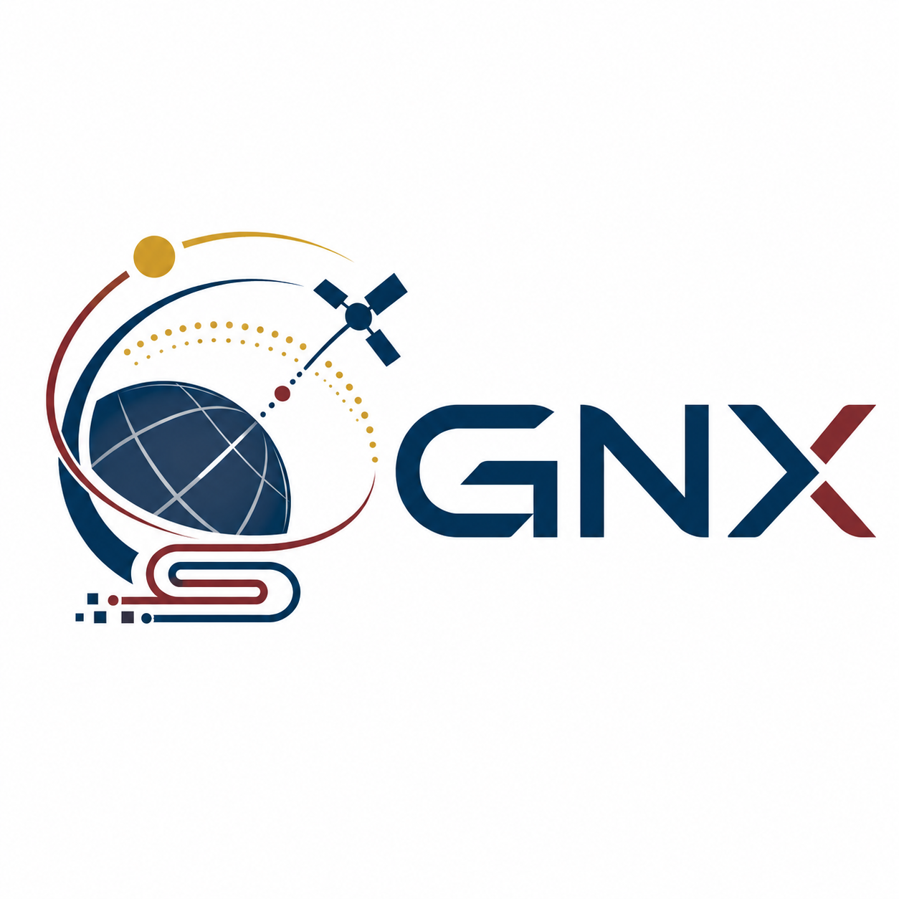

# GNX-py

<p align="center">
  
</p>

*A modular Python library for GNSS positioning, signal-in-space analysis, and ionosphere research workflows.*

---

## Overview

**GNX-py** is a research and engineering Python library for processing Global Navigation Satellite System (GNSS) data. It is designed for experiments with positioning algorithms, multi-constellation products, orbit and clock quality analysis, and ionosphere/TEC processing.

The library currently focuses on:

- **GNSS positioning** with SPP and PPP workflows.
- **Precise Point Positioning (PPP)** in combined, uncombined, single-system, and selected mixed-system modes.
- **Orbit and signal-in-space analysis** including broadcast-vs-precise and SP3-vs-SP3 comparisons.
- **STEC/TEC and ionosphere processing** using RINEX observations, GIM/IONEX products, empirical models, and bias products.
- **Modern GNSS data workflows** using RINEX, SP3, ANTEX, SINEX, OSB/DCB/DSB/BIA, and GIM/IONEX-style products.

GNX-py supports **GPS**, **Galileo**, and **BeiDou/BDS**. It is actively developed as open-source research software, so the codebase intentionally exposes both mature workflows and newer validation branches. The README below describes that status explicitly.

---

## Current Capabilities

### Supported GNSS systems

- **GPS (`G`)**: mature support across SPP, PPP, STEC, and SIS/SISRE workflows.
- **Galileo (`E`)**: mature support across GPS/Galileo PPP, SPP, STEC, and orbit analysis workflows.
- **BeiDou/BDS (`C`)**: active support through a shared signal metadata layer for RINEX observation selection, broadcast navigation, SPP, PPP, STEC, and SIS/SISRE analysis.

The default BeiDou dual-frequency mode is **`B1IB3I`**. This is the safest current BDS mode in the examples and validation tests. Modern BDS modes such as `B1C`, `B2a`, and `B2b` are represented in the signal metadata and selected processing branches, but they require matching RINEX 4 navigation fields and clock-consistent OSB/DSB products before being treated as production-stable.

### SPP

GNX-py includes Single Point Positioning through `gnx_py.spp`:

- broadcast-orbit SPP as the simplest workflow;
- precise-orbit SPP when SP3 products are supplied;
- GPS, Galileo, BeiDou, and mixed `G/E/C` system selections;
- one receiver-clock state per active constellation in mixed runs;
- configurable ionosphere models (`klobuchar`, `gim`, `ntcm`, or disabled) and troposphere models.

Start with:

```bash
python examples/run_spp_example.py
```

### PPP

The `gnx_py.ppp` package implements Precise Point Positioning workflows around `PPPConfig` and `PPPSession`:

- ionosphere-free **combined PPP**;
- **uncombined PPP** with frequency-specific code and phase observations;
- single-system and mixed-system filtering;
- GPS, Galileo, and BeiDou/BDS support;
- precise SP3 orbit/clock workflows and broadcast-orbit validation paths;
- optional ionospheric constraints for uncombined PPP;
- OSB/DCB/DSB-style bias product ingestion;
- configurable EKF presets, trace diagnostics, cycle-slip preprocessing, antenna corrections, tides, relativity, and troposphere handling.

Recommended starting points are GPS/Galileo combined PPP and BDS-only `B1IB3I` PPP. Mixed uncombined modes are powerful but more sensitive to product and bias consistency.

### PPP ambiguity resolution

PPP ambiguity resolution is available as an advanced feature in selected PPP branches:

- enabled by `pppar_enabled=True`;
- LAMBDA integer least-squares search;
- ratio-test screening;
- lock-time / arc-age gating;
- optional elevation and candidate-count gates;
- optional partial fixing;
- soft hold constraints after accepted fixes;
- diagnostic columns for accepted/rejected ambiguity groups.

PPP-AR is **disabled by default**. Combined ionosphere-free AR is additionally guarded by `pppar_combined_if_ar_enabled=True` and should be treated as experimental. Use PPP-AR only after validating the float PPP solution, the phase-bias products, and the selected constellation/signal combination.

### Ionosphere and STEC

The `gnx_py.ionosphere` package provides STEC and ionosphere tools around `TECConfig` and `TECSession`:

- slant TEC measurement from dual-frequency geometry-free observables;
- GPS, Galileo, and BeiDou processing through shared GNSS signal metadata;
- GIM/IONEX reading and interpolation;
- bias policy controlled by `TECConfig.stec_bias_sources`;
- bias sources from products, GIM DCB blocks, manual configuration, or zero fallback;
- OSB, DCB, and DSB-style bias handling;
- Klobuchar, NTCM-style, and GIM-based model support;
- IPP geometry, mapping functions, and TEC/VTEC utilities;
- ionospheric activity indices such as SIDX, GIX-family diagnostics, ROT, and ROTI;
- experimental VTEC kriging in geographic or solar-geomagnetic frames.

`TECSession` currently processes one constellation at a time. For BeiDou STEC, `B1IB3I` is the best-covered current mode.

### Orbits, SIS, and SISRE

The `gnx_py.orbits` package provides signal-in-space analysis through `SISConfig` and `SISController`:

- broadcast-vs-precise orbit and clock comparison;
- SP3-vs-SP3 comparison on a common epoch grid;
- radial, along-track, and cross-track decomposition;
- SISRE/SIS-style metrics;
- optional satellite PCO correction with ANTEX;
- optional eclipse flagging and post-eclipse extension;
- DCB/OSB/DSB product ingestion where appropriate;
- GPS, Galileo, and BeiDou processing branches.

For BeiDou SIS/SISRE work, `B1IB3I` is the validated/stable starting mode for MEO/IGSO broadcast-vs-SP3 comparisons. BDS clock interpretation depends strongly on the selected signal, broadcast TGD/ISC convention, precise clock datum, and external bias products. Inspect `clock_convention_status` and related metadata before interpreting BDS clock metrics. BeiDou GEO is not supported in the current SIS/SISRE path and is skipped or guarded.

---

## Installation

GNX-py is packaged as `gnx_py`. The project metadata currently targets **Python 3.12**:

```text
requires-python = ">=3.12,<3.13"
```

### macOS / Linux editable install

```bash
git clone https://github.com/HJpierzchala/GNX.git
cd GNX

python3.12 -m venv .venv
source .venv/bin/activate
python -m pip install --upgrade pip
python -m pip install -e .
```

### Windows PowerShell editable install

```powershell
git clone https://github.com/HJpierzchala/GNX.git
cd GNX

py -3.12 -m venv .venv
.\.venv\Scripts\Activate.ps1
python -m pip install --upgrade pip
python -m pip install -e .
```

### Tutorial installation

The optional tutorial extra installs notebook-related dependencies:

```bash
python -m pip install -e ".[tutorial]"
```

For developer tools:

```bash
python -m pip install -e ".[dev]"
```

### Requirements and constraints files

The canonical dependency declaration is in `pyproject.toml`. The requirements files are kept for users who prefer requirements-file workflows:

- `requirements-runtime.txt`: runtime dependencies matching the package metadata.
- `requirements-tutorial.txt`: notebook/tutorial dependencies; equivalent in spirit to `.[tutorial]`.
- `requirements-dev.txt`: runtime, tutorial, and development/test tools.
- `constraints-macos.txt`: captured macOS dependency pins for reproducing a known setup.
- `constraints-win.txt`: Windows-oriented dependency pins for Python 3.12.

Use constraints as reproducibility aids, not as the primary source of package metadata.

### Verify the import

With the intended environment active:

```bash
python -c "import sys, gnx_py; print(sys.executable); print(gnx_py.__file__)"
```

For an editable install, `gnx_py.__file__` should point to this repository.

---

## Quick Start

Install GNX-py, then run the examples from the repository root:

```bash
python examples/run_spp_example.py
python examples/run_ppp_example.py
python examples/run_sise_example.py
python examples/run_stec_example.py
```

The scripts are intentionally small and editable. Each has a `USER SETTINGS` block near the top where you can change the station, constellation set, signal mode, product paths, time window, and output options.

By default, examples use `sample_data/`, run short smoke windows when configured to do so, and write generated files under `examples/output/`. Some workflows require matching observation, navigation, SP3, ANTEX, GIM, SINEX, and bias files; check the path block in each script before running with your own data.

Common signal-mode defaults:

- GPS: `L1L2`
- Galileo: `E1E5a`
- BeiDou: `B1IB3I`

---

## Basic Python Usage

```python
from gnx_py.spp import SPPConfig, SPPSession
from gnx_py.ppp import PPPConfig, PPPSession
from gnx_py.ionosphere import TECConfig, TECSession
from gnx_py.orbits import SISConfig, SISController
```

The example scripts are the recommended entry point before building custom workflows.

---

## Project Structure

```text
GNX/
├─ gnx_py/             # Python package: SPP, PPP, ionosphere, orbits, I/O, corrections
│  ├─ ppp/             # PPP filters, PPP session routing, PPP-AR helpers
│  ├─ ionosphere/      # STEC/TEC processing, GIM/IONEX, models, monitoring, kriging
│  └─ orbits/          # SIS/SISRE orbit and clock comparison tools
├─ examples/           # Small editable user examples using sample_data
├─ sample_data/        # Compact example products for smoke tests and tutorials
├─ tutorial/           # Jupyter notebooks and manual build tooling
├─ assets/             # Static repository assets
├─ GNX_manual.pdf      # Generated manual/tutorial PDF snapshot
├─ pyproject.toml      # Package metadata, dependencies, optional extras
├─ setup.py            # Setuptools compatibility shim
└─ README.md
```

Large tutorial data bundles may be distributed through GitHub Releases rather than committed directly to the repository.

---

## Documentation and Tutorials

- `examples/` contains small, editable scripts for SPP, PPP, SISE/SISRE, and STEC workflows.
- `gnx_py/ppp/README.md`, `gnx_py/ionosphere/README.md`, and `gnx_py/orbits/README.md` provide module-level notes for the main processing domains.
- `tutorial/` contains Jupyter notebooks that form a longer guided manual.
- `GNX_manual.pdf` is a generated snapshot of the manual/tutorial material.

The tutorial notebooks are the best place for longer exploratory workflows. The top-level README is intentionally a project overview, not a full API reference.

---

## Known Limitations and Validation Status

GNX-py is actively developed research software. The project has tests and example workflows for important branches, but not every constellation, receiver, station, product source, signal mode, and arc condition has the same validation depth.

Current limitations to keep in mind:

- GPS and Galileo workflows are generally the most mature.
- BeiDou support is active, with `B1IB3I` as the safest current default for SPP/PPP/STEC/SIS examples.
- Modern BDS `B1C`, `B2a`, and `B2b` paths require further validation in some processing branches, especially when precise clock datum and OSB/DSB consistency matter.
- BeiDou GEO is unsupported or skipped in current broadcast/SIS/SISRE paths.
- PPP-AR is advanced and disabled by default; it should be enabled only for controlled validation.
- Combined ionosphere-free PPP-AR is experimental and additionally disabled unless `pppar_combined_if_ar_enabled=True`.
- Mixed uncombined PPP, especially with BeiDou and no ionospheric constraints, is sensitive to product and bias consistency.
- Some public classes and exports are retained for legacy/reference compatibility and are not all ideal starting points for new workflows.
- Kriging, some model-comparison paths, and some ionosphere monitoring utilities are research-facing and should be validated for the selected dataset.
- `sample_data/` is meant for smoke tests, tutorials, and regression-style checks. It is not a full scientific validation dataset for every mode.

These limitations are intentional status markers. They make it easier to use stable paths confidently while keeping experimental GNSS research workflows accessible for validation.

---

## Contributing

Pull requests are welcome, especially for:

- additional validation datasets and reproducible examples;
- documentation and tutorial improvements;
- tests for new constellation/signal/product combinations;
- performance improvements that preserve numerical behavior;
- careful API cleanup with compatibility notes.

For ideas, bugs, or questions, open a GitHub Issue.

---

## Citation

If you use GNX-py in research, please cite the project repository and the relevant GNSS products, standards, and scientific methods used in your workflow. A formal `CITATION.cff` file or DOI entry has not yet been added.

---

## License

The package metadata declares the project license as **MIT** in `pyproject.toml`. A standalone `LICENSE` file is recommended for public releases if one is not included in the repository snapshot.

---

## Acknowledgements

GNX-py workflows align with GNSS standards and products from the broader geodesy community, including RINEX, SP3, ANTEX, SINEX, IONEX/GIM, IGS/MGEX-style product conventions, and classical PPP and ionospheric modelling literature.
